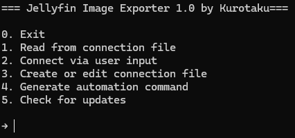
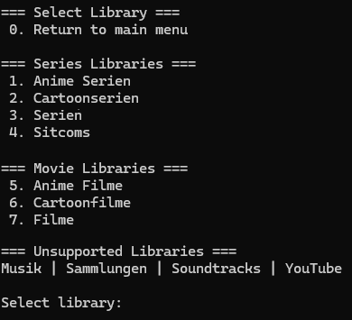
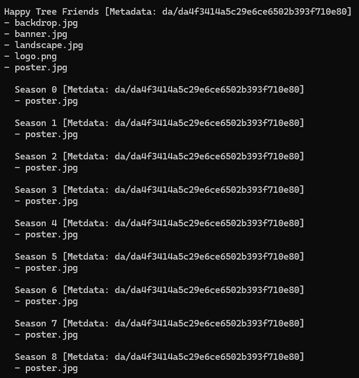
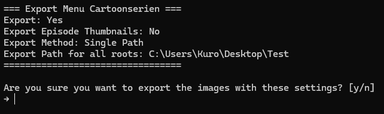
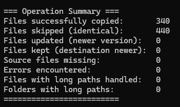
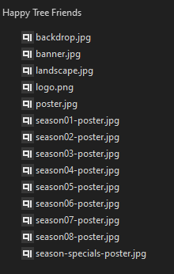

# Jellyfin Image Exporter

[](https://ko-fi.com/kurotaku1337)

A Python script to export images (posters, banners, thumbnails) from your Jellyfin media server's metadata library with both interactive and automation modes.

🧠 **Why this tool?**
Many users have been searching for a way to **easily back up or export metadata images** from their Jellyfin libraries. Unfortunately, Jellyfin does not natively support this, and no plugins exist to automate the process. This tool was created to fill that gap, allowing you to export all artwork without manually browsing every item.

It's especially useful if:
- You want to back up all media images in a structured format
- You're planning to reinstall Jellyfin and want to retain all artwork
- You want to copy images into your media folders for external use
- You need automated exports for backup scripts or media migrations

The script uses Jellyfin's internal metadata structure and mimics the folder layout so that:
- You can export to a separate backup location **or**
- Directly write to the original library folder (e.g. to restore artwork)

✅ The file and folder names are formatted in a way that Jellyfin recognizes them during rescans.

---

## Features

- **Export media images** from Jellyfin to your local file system
- Supports both **interactive menu mode** and **command-line automation**
- Supports both **TV Shows and Movies**
- Handles:
  - Series posters/banners
  - Season posters
  - Episode thumbnails (optional)
  - Movie artwork
- **Preserves folder structure** matching your media library
- **Smart file comparison** only updates changed files
- Supports **multiple library roots** with flexible export paths
- **Windows long path support** (>260 characters)
- **Command-line interface** with intuitive menus
- **No third-party dependencies** runs on plain Python out of the box

---

## Installation

1. Ensure you have **Python 3.8+** installed
2. Download the programm via releases
3. Run `main.py` to start the application

---

## Usage

Before exporting to your media folder, it's recommended to run a test export into a separate directory to verify that the structure is correct. Of course, I can't cover every possible case or library structure, so there's no 100% guarantee, but with standard setups, it should work on both Linux and Windows.

### Interactive Mode

1. **Configure connection** to your Jellyfin server:
   - Server URL
   - API key
   - Path to Jellyfin metadata folder

2. **Select a library** to export from:
   - TV Show libraries
   - Movie libraries

3. **Configure export options**:
   - Export path(s)
   - Include episode thumbnails (for series)
   - Choose whether to export all images to a single folder, or keep separate folders for each library root

4. **Review and confirm** the export

### Automation Mode (Command Line)

It is recommended to generate the command using the **"Generate automation command"** option in the menu.
Run exports directly from command line or scripts:

```bash
python main.py --library_id "your-library-id" --export_method "single|separate" --episode_thumbnails "true|false" --target_paths "path1|path2|..." --connection_method "file|parameters" [--url "http://your-jellyfin-server"] [--api_key "your_api_key"] [--library_path "/path/to/metadata"]
```

**Parameters:**
- `--library_id`: ID of the Jellyfin library to export (required)
- `--export_method`: `single` (one output location) or `separate` (multiple paths) (required)
- `--episode_thumbnails`: Export episode thumbnails (`true`, `1`, or `yes`) (default: `false`)
- `--target_paths`: Export paths separated by the `|` character (required)
- `--connection_method`: `file` to use `connection.json`, or `parameters` to manually pass Jellyfin server credentials (default: `file`)
- `--url`: Jellyfin server URL (required if `connection_method=parameters`)
- `--api_key`: Jellyfin API key (required if `connection_method=parameters`)
- `--library_path`: Path to the Jellyfin metadata folder (required if `connection_method=parameters`)

**Example with connection method `file`:**
```bash
python main.py --library_id "12345abcdef" --export_method "single" --episode_thumbnails true --target_paths "/exports/tvshows" --connection_method file
```

**Example with connection method `parameters`:**
```bash
python main.py --library_id "12345abcdef" --export_method "separate" --episode_thumbnails false --target_paths "/mnt/anime|/mnt/cartoons" --connection_method parameters --url "http://localhost:8096" --api_key "123456789" --library_path "/var/lib/jellyfin/metadata"
```

---

## Configuration

The script uses a `connection.json` file to store your Jellyfin connection details. You can:
- Create a new connection file
- Edit existing connection
- Test connection before exporting

Template `connection.json`:
```json
{
    "url": "http://your-jellyfin-server:8096",
    "api_key": "your-api-key-here",
    "library_path": "/path/to/jellyfin/metadata/library"
}
```

library_path is the folder containing the Jellyfin metadata.
This is typically a directory filled with many subfolders, each named with exactly two characters, like `ab`, `1f`, `3c`, `a8`, etc.

The machine running this programm must have access to this path, as it will copy metadata files from there.

## Requirements

- Python
- Jellyfin server with API access
- Proper permissions to access:
  - Jellyfin API
  - Metadata folder
  - Export destination folders

---

## Screenshots

<br>
*Main menu interface*

<br>
*Library Menu*

<br>
*Export preview*

<br>
*Export configuration*

<br>
*Operation Summary*

<br>
*Folder*

---

## Support

- For **bug reports or issues**, contact me directly on **Discord (Kurotaku)**
- Please include detailed information about any problems

---

## Notes

This tool does **not** generate `.nfo` files. To enable NFO generation in Jellyfin:
1. Go to **Library** → **Advanced** → **Metadata Savers**
2. Enable **NFO** option
3. Trigger **Refresh Metadata** with "Search for missing metadata"

This will put all .nfo files in your file system

---

## License

This project is licensed under **CC BY-NC-SA 4.0**.
You may share and adapt the material for non-commercial purposes, with attribution and under the same license.

For details: [Creative Commons License](https://creativecommons.org/licenses/by-nc-sa/4.0/)

---

## Disclaimer

This software is provided as-is without any warranty. The developer is not responsible for any potential issues including but not limited to data loss or system instability. Use at your own risk.